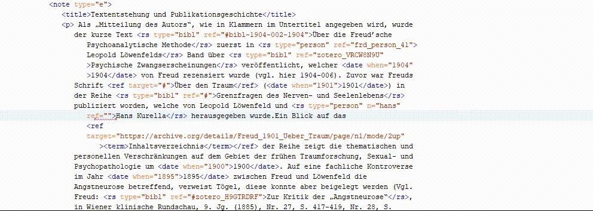
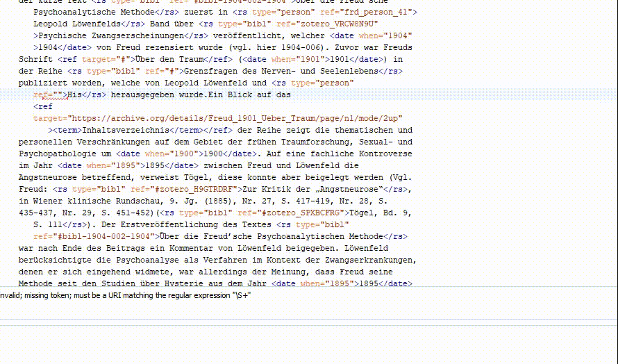

# TEI Completer
[](https://github.com/BCDH/TEI-Completer/actions/workflows/ci.yml)
[](http://java.oracle.com)
[](https://www.gnu.org/licenses/gpl-2.0.html)
[](https://repo1.maven.org/maven2/org/humanistika/oxygen/tei-completer/1.2.1/tei-completer-1.2.1-oxygen-plugin.jar)

The TEI Completer is a highly customizable plugin for setting up and activating remote-driven autocompletions of attribute values in the [oXygen XML Editor](http://www.oxygenxml.com).  

We use it in a variety of contexts ranging from morphosyntactic annotation and standardization of historical spellings, to linking words with particular dictionary senses and reference strings with entries in authority files.

We hope that this tool will also be of use to other DH scholars who need to populate [TEI](http://www.tei-c.org/Guidelines/P5/) attributes with values stored and maintained elsewhere. 

With the TEI Completer, you can:

- construct specific URLs for server queries
- define context elements in your TEI, the attribute to autocomplete on, and an optional dependency (i.e. another attribute value to send to the server in order to generate suggestions)
- use basic or digest HTTP authentication, should you need it
- accept either XML or JSON-formatted responses from the server
- optionally transform server responses with XSL or JavaScript to the format required by the plugin

The plugin will communicate with your server(s) and provide autocomplete suggestions based on the values in your context element(s) — all this from the comfort of your favorite XML editor. 

The plugin has been developed at the [Belgrade Center for Digital Humanities](http://www.humanistika.org/) under the motto "*TEI, You... complete me.*"


# Installation

1. Download the precompiled binary of the TEI Completer from [here](https://repo1.maven.org/maven2/org/humanistika/oxygen/tei-completer/1.2.1/tei-completer-1.2.1-oxygen-plugin.jar) or [build from source](#building).

2. Copy the file `tei-completer-1.2.1-oxygen-plugin.jar` to `$OXYGEN_HOME/frameworks/tei`.

	- The location of `$OXYGEN_HOME` will depend on where you have installed Oxygen XML Editor. The following are the known
default locations for Oxygen:

  		* Mac OS X: `/Applications/oxygen`

  		* Linux: `~/Oxygen XML Editor 20.1`, or if *sudo*: `/opt/Oxygen XML Editor 20.1`

  		* Windows: `C:\Program Files\Oxygen XML Editor 20.1`

3. Create a [Configuration File](#configuring)

4. Start Oxygen XML Editor.

5. In Oxygen, click on the *File* -> *Preferences* menu, or if you are on Mac OS X then the *Oxygen XML Editor* -> *Preferences* menu.

6. Select and expand the *Document Type Associaton* item from the left panel.

7. Scroll down and select the `TEI P5` Document Type Association. 

	

8. Click the *Edit* button under the list of Document Type Associations

9. Select the *Classpath* tab, and then click on the `+` button under the list of paths.

10. In the dialog box *Add resources to the classpath*, enter the following text `${framework}/tei-completer-1.2.1-oxygen-plugin.jar`, and then click the *OK* button.

	

11. Select the *Extensions* tab, and then click the *Choose* button beside the entry for *Content completion handler*.

12. Select the `TEI Completer - org.humanistika.oxygen.tei.completer` plugin, and then click the *OK* button. 

	

13. Click the *OK* button to leave the TEI P5 Document Type association dialog, click the *OK* button again to leave the Oxygen Preferences dialog.

# Usage
When editing you press the auto-complete shortcut `CTRL/⌘ + SPACE` then you can select from the drop-down menu.


Sometimes the auto completer can not pull all the context from the current tag, in this case you can  press the auto-complete shortcut `CTRL/⌘ + SPACE` then select the custom entry from the drop down menu, a dialog will show up where you can enter the context for the auto complete then click on the fetch button and select the wanted value from the list.



# Configuring

The TEI Completer uses an XML configuration file whoose syntax is documented in the XML Schema [config.xsd](https://raw.githubusercontent.com/BCDH/TEI-Completer/master/src/main/resources/config.xsd).

The XML file must be named `config.xml` and placed in a folder named `.bcdh-tei-completer` in your user profile. The
following are the known locations for the config file:

  * Mac OS X: `~/.bcdh-tei-completer/config.xml`

  * Linux: `~/.bcdh-tei-completer/config.xml`

  * Windows: `%USER_PROFILE%\Application Data\.bcdh-tei-completer\config.xml`


A sample `config.xml` which requests auto-completion suggestions for all `//w/@lemma` attributes from a server and also considers the value of the dependent attribute `//w/@ana` value, would look like:

```xml
<?xml version="1.0" encoding="UTF-8"?>
<config xmlns="http://humanistika.org/ns/tei-completer">
    <server>
        <authentication type="Preemptive-Basic">
            <username>my-username</username>
            <password>my-password</password>
        </authentication>
        <baseUrl>http://my-server.com/multext</baseUrl>
    </server>
    <autoComplete>
        <context>//w</context>
        <attribute>@lemma</attribute>
        <dependent default="default-ana">@ana</dependent>
        <selection>./text()</selection>
        <request>
            <url>$baseUrl/getlemma.php?selection=$selection&amp;dependent=$dependent</url>
        </request>
        <response>
            <transformation>getLemmaOutput.xslt</transformation>
        </response>
    </autoComplete>
</config>
```
You can use labels on Custom entry dialog by setting them in the `config.xml`
```xml
<dependent default="default-ana" label="the label you want to show up on the dialog">@ana</dependent>
<selection label="the label you want to show up on the dialog">./text()</selection>
```

If you wish to use a response transformation, these must be written in either XSLT (1.0 or 2.0) or JavaScript (<=1.8). The transformation file must be resolved relative to `config.xml`, that is to say that you should place your transforms in the same folder as `config.xml` (see above). See the [Response Transformations](#response-transformations) section for further details.

***NOTE*** Changes to the configuration require restarting Oxygen to be detected.


# Server Messages

Servers are expected to respond to the plugin using an XML or JSON document, which contains the suggestions for
auto-completion. The XML format is documented in [suggestions.xsd](https://raw.githubusercontent.com/BCDH/TEI-Completer/master/src/main/resources/suggestions.xsd).
The JSON format is a direct conversion of the XML format.

However, if your server already has a fixed format, you may use a [Response Transformation](#response-transformations) to transform the response from your server to that shown below.


* Example of the XML format:

```xml
<?xml version="1.0" encoding="UTF-8"?>
<suggestions xmlns="http://humanistika.org/ns/tei-completer">
    <suggestion>
        <value>suggestion1</value>
        <description>A description of suggestion 1</description>
    </suggestion>
    <suggestion>
        <value>suggestion2</value>
        <description>A description of suggestion 2</description>
    </suggestion>
</suggestions>
```

* Example of the JSON format:

```json
{
    "tc:suggestion": [
        {
            "tc:value" : "suggestion1",
            "tc:description" : "A description of suggestion 1"
        },
        {
            "tc:value" : "suggestion2",
            "tc:description" : "A description of suggestion 2"
        }
    ]
}
```


# Response Transformations

If your server does not or cannot return data in either the XML or JSON format described in the [Server Messages](#server-messages) section, then you can create a Response Transformation file to convert the format of the data supplied by your server to that required by the TEI-Completer.

Each Response Transformation file must be listed in the [config.xml](#configuring).

## XML Transformation

If your server provides data in an XML format, then you may use either XSLT 1.0 or XSLT 2.0 to transform that response. The entire XML document from your server will be provided to the XSLT stylesheet as the default context item. Your XSLT transformation must return a single XML document in the format required by the TEI-Completer.

## JSON Transformation

If your server provides data in a JSON format, then you may use JavaScript (<= 1.8) to transform that response. You must implement a JavaScript function named `transform`. The `transform` function must accept a single argument which is the JSON object from your server, and must subsequently return a JSON object in the format required by the TEI-Completer.

### Example JSON transformation

If for example your server was to provide JSON data in the following format:
```javascript
{
    "sgns": [
        {
            "v": "suggestion1",
            "d": "A description of suggestion 1"
        },
        {
            "v": "suggestion2",
            "d": "A description of suggestion 2"
        }
    ]
}
```

Then an appropriate JavaScript `transform` function might look something like:
```javascript
function transform(content) {
    var suggestion = [];

    for(var i = 0; i < content.sgns.length; i++) {
        suggestion.push(
            {
                "tc:value" : content.sgns[i].v,
                "tc:description" : content.sgns[i].d
            }
        )
    }

    var suggestions = {
        "tc:suggestion": suggestion
    }

    return suggestions;
}
```

# <a name="troubleshooting"></a> Troubleshooting

If you have unexpected issues with the TEI Completer plugin for oXygen XML Editor, it may be useful to enable logging in oXygen to gather more information.
oXygen utilises the log4j logging framework, and the TEI Completer plugin is also designed to write its log messages to that framework. To enable logging in Oxygen see this article: [Where are oxygen author application log files?](https://www.oxygenxml.com/forum/common-problems/topic22087.html).

# <a name="building"></a> Building from Source Code

* Requirements: Git, Apache Maven 3, Java JDK 11

```bash
$ git clone https://github.com/BCDH/TEI-Completer.git
$ cd TEI-Completer.git
$ mvn package
```

The compiled uber jar file can then be found at `target/tei-completer-1.2.1-SNAPSHOT-oxygen-plugin.jar`.


# Acknowledgements

Hats off to [Adam Retter](https://github.com/adamretter) for agreeing to share his superb programming skills with us. 

This tool has been developed in the context of two ongoing BCDH projects: *Raskovnik - A Serbian Dictionary Platform* (together with the Institute of Serbian Language), and *Izdanak - Digital Editions of Serbian Texts* (together with the Vuk Karadžić Foundation). Both projects have received funding from the Ministry of Culture and Information of the Republic of Serbia. 

---


---
